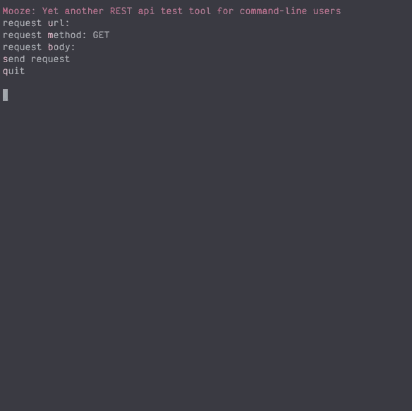

# Mooze

A command-line REST api test tool  

## Preview



## Install

mooze requires go to be installed  
only supports linux system for now (tested under WSL-Ubuntu, windows terminal)  

```
$ git clone https://github.com/rudy3091/mooze.git ~/.mooze
$ cd ~/.mooze
$ go build
$ ln -s ~/.mooze /usr/local/bin/mooze
$ mooze
```

## Keybindings

- Handling Request Data
	- \[u\]: Enter input mode for target url  
	- \[m\]: Enter input mode for http method  
	- \[b\]: Enter input mode for request body(as json)  
	- \[h\]: update request header / add new request header

- Handling Application
	- \[r\]: refresh screen
	- \[s\]: Send request  
	- \[q\]: Quit application  

## TODOS

Add test codes  
Check response time  
Add history mngment (with additional tui)  
Add bulk request feature  
